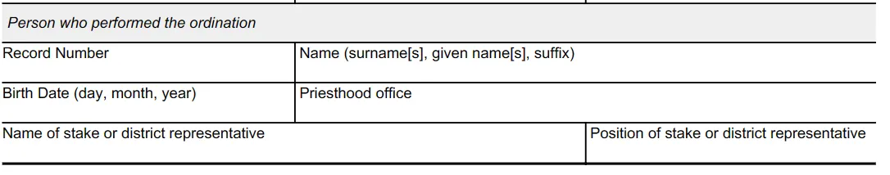

The church handbook states stake leaders are asked to [witness Melchizedek Priesthood ordinations](https://www.churchofjesuschrist.org/study/manual/general-handbook/18-priesthood-ordinances-and-blessings?lang=eng&para=title_number32-p160#title_number32). Here’s a step-by-step.

1. Receive the person’s ordination form from the stake
2. Coordinate the appointment with local unit leaders.
3. The person receiving the priesthood chooses who will confer the priesthood. The person should be a worthy Melchizedek priesthood holder. The Bishop/Branch President can determine worthiness standing.
4. Be present during the ordination and verify the ordinance is performed according to the handbook instructions in [18.10.5](https://www.churchofjesuschrist.org/study/manual/general-handbook/18-priesthood-ordinances-and-blessings?lang=eng#title_number34)
5. Enter the Melchizedek priesthood holder’s information who did the ordination on the form. See screenshot below.
6. Enter your name on the field “Name of stake or district representative” and your calling in the “Position of stake or district representative”
7. Submit the form back to the stake (text/email a photo of the form works when the physical form can’t be returned)

