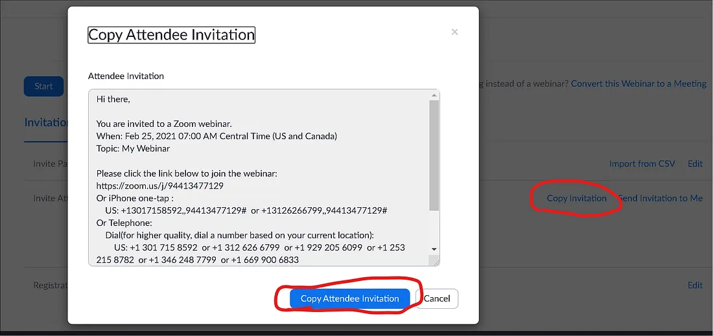
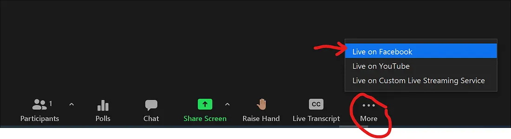
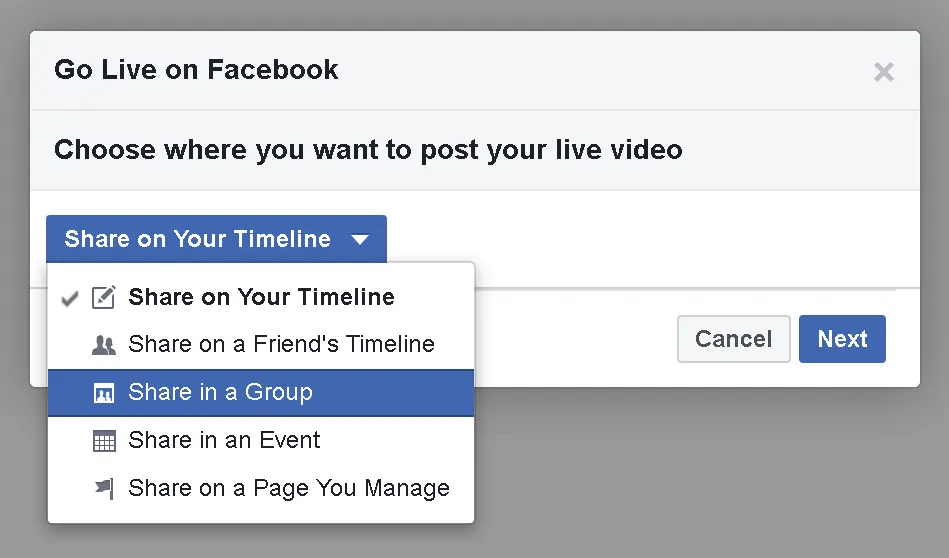
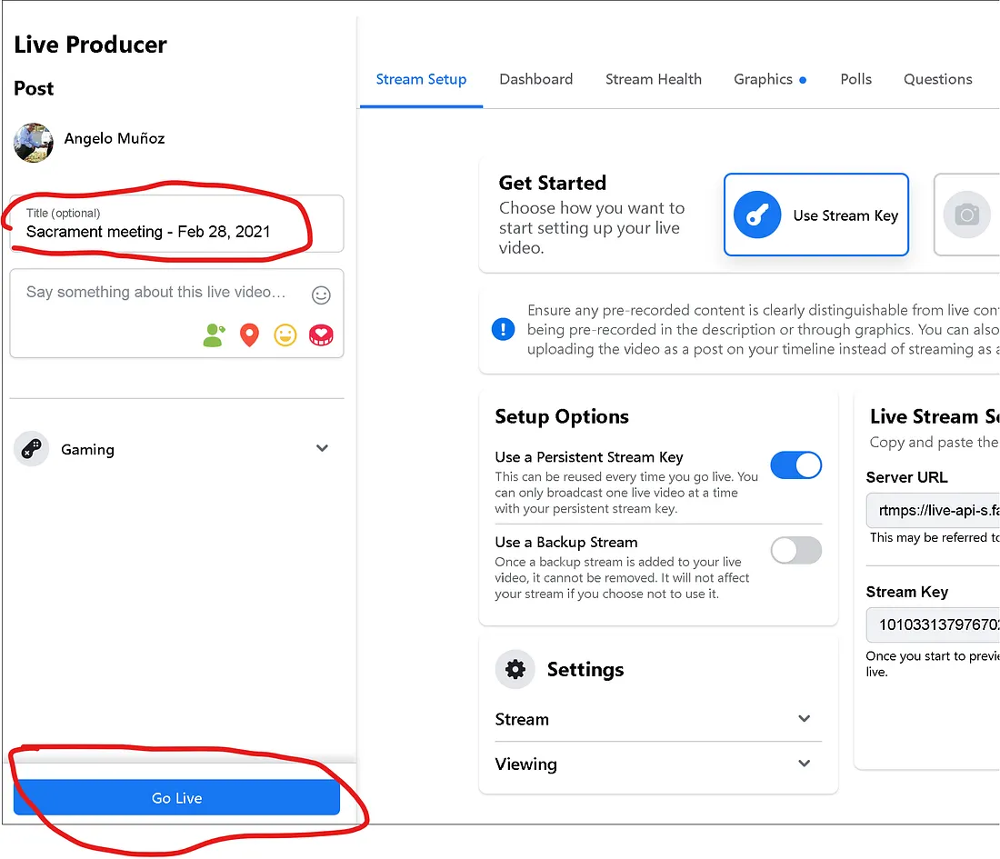

Follow the instructions below to broadcast a meeting with your church zoom account.

If your ward/branch doesn’t yet have a church-provided zoom account, see How to get a church zoom account.

---

## Sacrament meetings (or other meetings where attendees cannot unmute)

To maintain the reverence of the sacrament, use a webinar to broadcast so attendees are automatically muted. This prevents accidental unmuting.

Follow these instructions to broadcast with a webinar.

### Setup your webinar (Do this days/weeks in advance)
1. Login to zoom. https://www.zoom.us
2. Create a “webinar”. Click on “Webinars” in the left pane and click “Schedule Webinar.” Name the webinar and choose a date.
  
   *📝 Note: a webinar is different from a meeting as it’s specially made for broadcasts where attendees cannot unmute themselves.*

3. Share the link with attendees.
Click on your webinar title in the “Webinars” pane, and scroll to the “Invitations” section on the bottom of the page. Click the “Copy Invitation” button. A window will open. Click the “Copy Attendee Invitation” button. Now you can share that link with anyone by pasting the link on email, or Facebook or other ways.

4. Set up at the church building (or at home if broadcasting from home)

If broadcasting from the church, place a laptop, phone, or camera pointing at the pulpit.

*💡 Pro Tip: Make sure you are close enough to see the person’s face on the video when they stand at the pulpit.*

(Advanced/optional) Connect the chapel’s auxiliary audio output to the broadcasting device as an input. This gives clear and crisp audio without echo.

### Start your webinar (the day of the broadcast)

1. Login to zoom, click on your webinar title, and click “Start this Webinar” button.

2. (Optional but recommended) Using a second device, login to the webinar to make sure it started and you can see and hear clearly. This is what other attendees will see.

*💡 Pro Tips:*

1. Use a wired connection. Wifi-only connections may result in slow or choppy audio/video for participants.
2. The speaker should be in a room with good lighting. Avoid dark rooms where you won’t be seen clearly.
3. Where possible, sit close enough to the camera so your face takes up approximately 30% of the screen and is center screen.
4. Test the broadcast well in advance to familiarize yourself with the process.
5. Using a second device, login to the webinar to make sure it started and you can see and hear clearly. This is what other attendees will see.

### Broadcast using Facebook (optional)

If you prefer to use Facebook live (to a private group) instead of the zoom webinar, follow the instructions below:

* 📝 Note: on Facebook, attendees can listen only; they cannot speak or respond to questions. They can add comments but you can’t hear them speak.*

1. After you’ve opened the webinar in zoom, on the bottom bar, choose the “…” (ellipsis) link and choose “Live on Facebook”. A new browser tab will open asking to login to Facebook.

2. Login to Facebook, and choose your live settings.

Choose “Share in a group” and pick your group from the groups (type your unit name to search)

Enter the meeting title. Ex: “Sacrament meeting (date)” and click the blue “Go Live” button.

### Sunday School or other meetings where attendees can speak in class

Follow the instructions above but create a “Meeting” instead of a webinar.

*📝 Note: With “Meetings”, attendees can unmute to participate with comments or offer prayers, etc.*