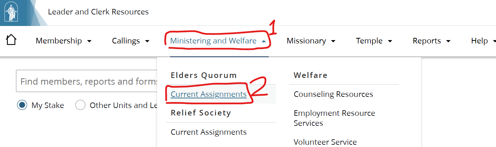
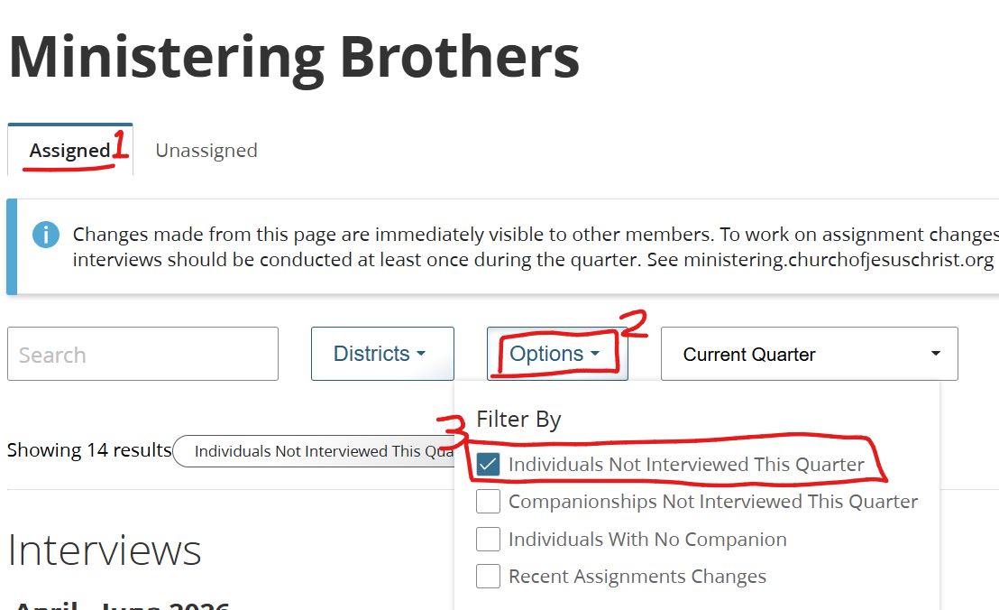
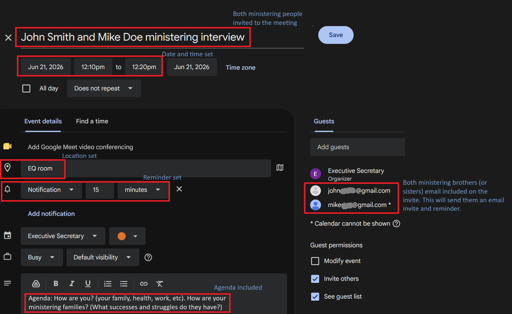

> The elders quorum president and his counselors interview ministering brothers. The Relief Society president and her counselors interview ministering sisters. [HB 21.3](https://www.churchofjesuschrist.org/study/manual/general-handbook/21-ministering?lang=eng#title_number4)

Our leaders teach "Ministering means serving others as the Savior did. He loved, taught, prayed for, comforted, and blessed those around Him. As disciples of Jesus Christ, we seek to minister to God’s children." - Handbook [Chp 21](https://www.churchofjesuschrist.org/study/manual/general-handbook/21-ministering?lang=eng). As such, it's vital for Elders Quorum and Relief Society Presidencies ensure families are cared for. They do this through ministering interviews with the assigned ministering brother or sister. 

Coordinating ministering interviews is an important part of organizing the work to best care for our brothers and sisters. Some units may call a Ministering Secretary, who as part of their duties schedules interviews and marks them complete following the interview. Where a Ministering Secretary is not called, Elders Quorum or Relief Society secretaries perform these duties.

This article discusses ways to schedule and track interview completion.

# Types of Ministering Interviews
Ministering interviews can be done in a variety of ways. Use the method that works best for the companionship although in-person interviews are recommended. 

Some options are in-person, phone call, or text. These options can be rotated depending on the companionship's availability. Discuss with your EQ or RS president any background information to get to know the ministering brothers and sisters. 

# Scheduling
Each ministering companionship is to be interviewed once per quarter. The president and counselors each have interviews with the companionships in their assigned district. So, schedule interviews for the president and his/her assigned district, and schedule separate interviews for each counselor and his/her assigned district. 

Below are some recommendations for scheduling interviews. 

## Presidency Availability and Duration
Check with your presidency when they prefer to do the interviews. After church or Weds evenings work best for most people. 

The handbook teaches, "Ministering interviews do not need to be long to be effective." Counsel with your presidency how long they prefer the interview. Typical times range from 5-15 minutes, and each companionship may require more or less time. More important than the duration is that the presidency member have sufficient time for ministering brothers and sisters to feel loved, appreciated, supported, trained if needed, and encouraged. See the [Purposes of Ministering Interviews](https://www.churchofjesuschrist.org/study/manual/general-handbook/21-ministering?lang=eng#title_number4:~:text=Their%20purposes%20are,in%20their%20service.) for additional information. 

## Which Companionships To Schedule

1. Choose companionships from the [Current EQ Ministering Assignments](https://lcr.churchofjesuschrist.org/ministering?lang=eng&type=EQ) or [Current RS Ministering Assignments](https://lcr.churchofjesuschrist.org/ministering?lang=eng&type=RS) report in LCR, or in the "Ministering Brothers" and "Ministering Sisters" screen in the Tools mobile app. The screenshot below shows how to navigate the menu to get to the LCR report. 

2. Filter by the "Not Interviewed This Quarter" option. This will only show the companionships that need interviews this quarter. The screenshot below shows how to apply that filter in the LCR report. 

## Scheduling with the Companionship
Both members of the ministering companionship should be included in the interview. - [HB 21.3](https://www.churchofjesuschrist.org/study/manual/general-handbook/21-ministering?lang=eng#title_number4:~:text=with%20both%20members%20of%20the%20companionship.)

Ask the people in person. When that's not possible or practical, send text messages or call them. 

## What To Say
The first thing is to be genuine in your efforts to help people. Try to connect with them as brothers and sisters. 

See [How to Initiate Contact](https://paducahkystake.github.io/executive-secretary-duties#:~:text=How%20To%20Initiate%20Contact) for some tips. See also `What To Say To Be Welcoming`, `What To Do (and not do) When a Member Stops Responding To Your Messages`, and `Examples` on that page. 

## Use a Calendar
Using a calendar (paper or digital) is a great way to keep track of the interview dates and times for each presidency member. 

Below are some tips for scheduling: 
* Include start time and duration on the calendar. This shows you how much time each will take and when to tell the next interview when to show up. :) 
* Send a reminder to presidency member and the companionship members. Text message (or built-in digital calendar reminder tools) are useful for reminders. 

### Digital Calendars
A few tips for those using digital calendars. 

1. Digital calendars are free ([Google Calendar](https://calendar.google.com/), [Outlook Calendar](https://outlook.live.com/calendar), etc). The stake uses Google and it's worked well. 
2. Keep each presidency member's appointments separate. 

    * Option 1: Use 1 calendar and invite each presidency member by email. 
    * Option 2: Make a separate calendar for each presidency member. 
2. These fields are useful: title, date and time, location, reminder, and recipients. Below is a screenshot of a well-crafted calendar invite. 

# Tracking The Completed Interviews
Here are some tips to marking the interviews. 

1. Check with the presidency member if he/she met with the companionship
2. If no, repeat the process to schedule the companionship.
3. If yes, mark the interview complete. See screenshot below with steps to mark the interview complete. 

# Conclusion
Ministering Secretaries (or organization secretaries) play an important role in scheduling and tracking ministering interviews. By following the instructions and tips in this guide, leaders can better meet with each ministering companionship. 